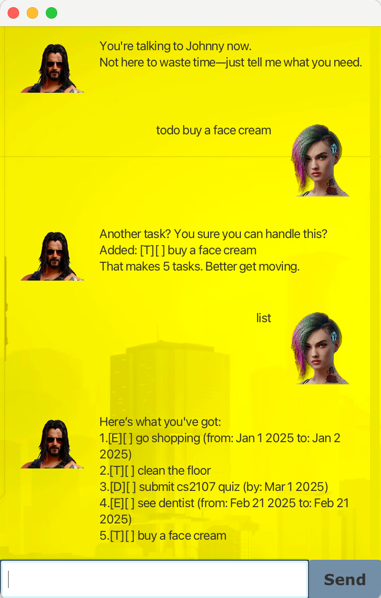

# Johnny - Task Management Chatbot



Johnny is a command-line chatbot that helps you manage tasks efficiently. Inspired by **Cyberpunk 2077's Johnny Silverhand**, this chatbot ensures that you stay on top of your schedule while keeping interactions entertaining.

Johnny supports 3 different types of tasks:

* **To-Do** (just description)
* **Deadline** (description + deadline by which the task must be completed)
* **Event** (description + start time + end time)

---

### **1. Prerequisites**
- Ensure you have **Java 17** installed.
- Verify installation with:
  ```sh
  java -version

### **2. Running Johnny**
- To launch Johnny, download the Johnny.jar file on your local computer, navigate to the directory containing Johnny.jar, and run:
```angular2html
java -jar Johnny.jar
```
You’ll be greeted by Johnny, ready to take commands.

### **3. Commands**

<table>
  <tr>
    <th>Command</th>
    <th>Description</th>
    <th>Example</th>
  </tr>
  <tr>
    <td>todo</td>
    <td>Adds a ToDo task</td>
    <td>todo read book</td>
  </tr>
  <tr>
    <td>deadline</td>
    <td>Adds a task with a deadline</td>
    <td>deadline submit cs2107 quiz /by 2025-03-01</td>
  </tr>
  <tr>
    <td>event</td>
    <td>Adds an event with a time range</td>
    <td>event attend a party /from 2025-03-03 /to 2025-03-04</td>
  </tr>
  <tr>
    <td>list</td>
    <td>Lists all the tasks</td>
    <td>list</td>
  </tr>
  <tr>
      <td>mark</td>
      <td>Marks a task as done</td>
      <td>mark 2</td>
    </tr>
  <tr>
    <td>unmark</td>
    <td>Marks a task as not done</td>
    <td>unmark 2</td>
  </tr>
  <tr>
    <td>delete</td>
    <td>Deletes a task</td>
    <td>delete 1</td>
  </tr>
  <tr>
    <td>find</td>
    <td>Finds tasks containing the keyword</td>
    <td>find party</td>
  </tr>
  <tr>
    <td>undo</td>
    <td>Undoes the last command</td>
    <td>undo</td>
  </tr>
  <tr>
    <td>bye</td>
    <td>Exits Johnny</td>
    <td>bye</td>
  </tr>
</table>


### **3. Error handling**
Johnny throws shade if you mess up. Here are some common mistakes and their responses:
```angular2html
hi
```
Johnny Says:
```
"That supposed to be a command? ‘Cause all I see is keyboard smashing..."
```

### **4. Testing Johnny**
To run automated tests, navigate to ip directory and run:
```angular2html
./gradlew test
```
It will output whether build is successful or failed depending on the result of the tests.

Before running the tests, make sure that your initial storage with tasks is empty.


